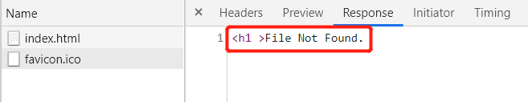

#### `socket.getInputStream`读取阻塞问题

```java
// 实际上readLine()是一个阻塞函数，当没有数据读取时，就一直会阻塞在那，而不是返回null；
// readLine()只有在数据流发生异常或者另一端被close()掉时，才会返回null值。
// 而在模拟中，inputStream是否关闭，由客户端（即浏览器）负责；所以readLine()无法返回null
while((line=reader.readLine())!=null){
    System.out.println(line);
}

// 解决方案 - 使用reader.ready()
do{
    if((line=reader.readLine())!=null){
        System.out.println(line);
    }
} while(reader.ready()); //当缓冲区不为空，ready()返回true
```


#### GET /favicon.ico HTTP/1.1

`favicon.ico` 图标用于收藏夹图标和浏览器标签上的显示，如果不设置，浏览器会请求网站根目录的这个图标，如果网站根目录也没有这图标会产生 404。

下图是自己测试用例的response：

